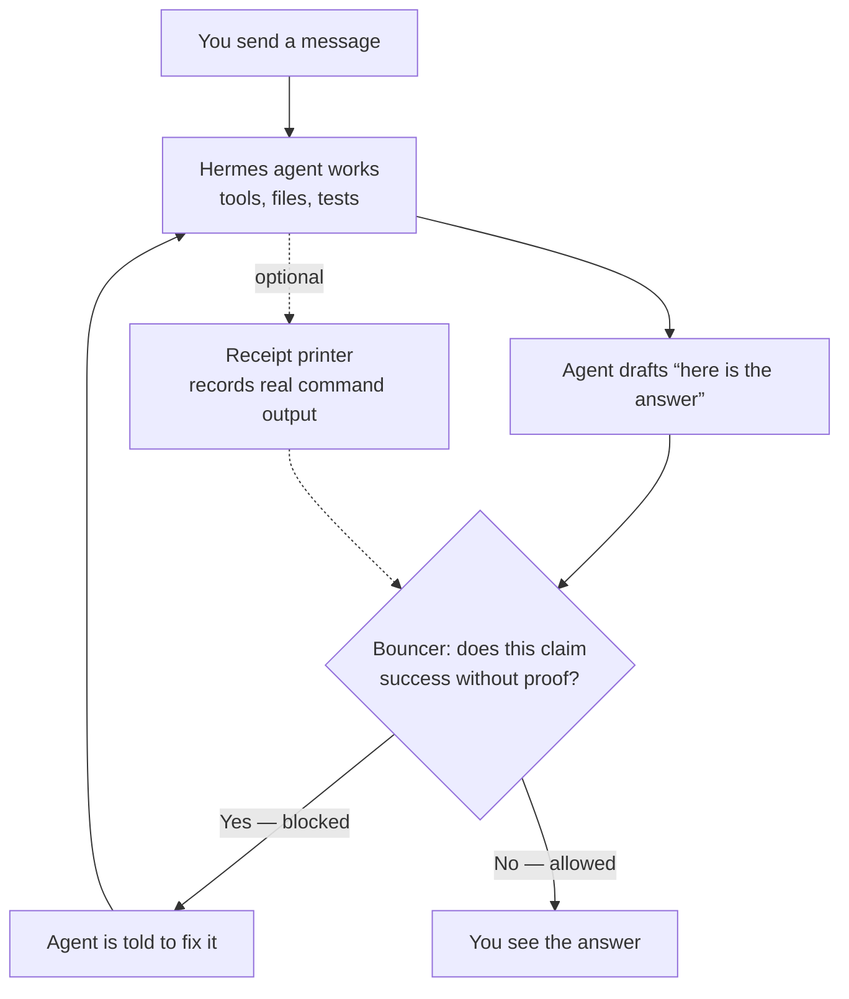

# hermes-reliability-recipe

**Unofficial add-on for [Hermes Agent](https://hermes-agent.nousresearch.com/).** Not made by Nous Research.

## TL;DR

Fast AI agents often *sound* finished when they are not. They will say “tests passed” or “I wrote the file” because that is a satisfying sentence — not because they checked.

This repo is a **lie detector for those finish-line sentences**. After the agent drafts an answer, a small local program looks at the real disk and says “show me” or “try again.” You still have to review important work. This does not make the model smarter. It makes it harder to *fake* being done.

- It only checks **completion claims** (done / tests green / I wrote that file). Ordinary wrong opinions can still get through.
- It is **not a lock on the agent’s shell**. Dangerous commands are a separate Hermes setting.
- You can **take it off** with one uninstall command. Your profile is not replaced wholesale.
- Install is **opt-in per agent profile**. Nothing starts Telegram or Discord by itself.
- “Installed” means the **doctor** script prints PASS — not a chat message that says “all good.”

## What this is not

- Not a security sandbox
- Not official Nous software
- Not a promise the agent is correct
- Not a replacement for you reading the work

## Shape

Three layers, on purpose. Soft words first. Hard stop last.

| Layer | Everyday name | What it does |
|-------|----------------|--------------|
| 1 — **Gate** | Bouncer | Reads the draft answer. If it claims success without matching files / test receipts, the answer is blocked. |
| 2 — **Receipts** | Lab printout | Optional `truth` tool records that a command actually ran here. Harder to invent “pytest passed.” |
| 3 — **Reminders** | Sticky notes | Short lines added to the agent’s instructions: don’t invent paths, don’t say ship without proof. Nudges only. |

Plus ops tools you run yourself: **install**, **toggle** (on/off), **doctor** (health check), **uninstall**, optional **patch** so the bouncer runs even when the agent edited no files.

```
this repo
├── recipe/          the detector + reminder templates
├── scripts/         install / toggle / doctor / uninstall
├── extras/          optional “did my agent lie in a fake scenario?” tester
└── docs/            long-form how-to
```

It installs **into a Hermes profile** (`~/.hermes/profiles/<name>/`). It does not replace Hermes.

## Design

**Why a program, not a longer prompt?**  
Prompts are suggestions. Fast models ignore them under “please just ship it” pressure. The gate is ordinary Python. It does not ask another model. Same input → same block/allow.

**Why two hard layers?**  
The gate catches *language* (“tests passed”, “wrote `/tmp/x`”). Receipts catch *theater* (quoting some other project’s 151 passing tests). You can install the gate alone if the receipt binary will not run on an old Linux.

**Why surgical edits?**  
Your existing personality file and working-style stay. We append a marked section and keep a timestamped backup. Toggle off strips that section. Uninstall walks the same list in reverse.

**Why a global Hermes patch is optional — and loud?**  
Upstream Hermes sometimes skips the bouncer unless a file was edited. Pure chat-hallucination then walks out the door. The patch removes that skip. It touches **one Hermes source file for the whole machine** and **breaks on Hermes upgrades**. Skip it if you do not want that; doctor will say so.

**Safe defaults for a public clone**

- Command approvals stay on
- No gateway restart unless you ask
- Profile names must look like `myagent` (no `../` tricks)
- Turning approvals off needs a second explicit confirm

## How a turn works



Plain version: the model does not get the last word on “I finished.” The bouncer does.

## Undo (do this before you install, if you are cautious)

```bash
./scripts/uninstall.sh --profile YOUR_PROFILE --dry-run   # preview
./scripts/uninstall.sh --profile YOUR_PROFILE             # remove
```

That takes the detector out of that profile. The Hermes patch is global, so uninstall will ask before undoing it. Details: [docs/UNINSTALL.md](docs/UNINSTALL.md).

## What gets changed

| Where | What happens | Reversible? |
|-------|----------------|-------------|
| `~/.hermes/profiles/<NAME>/bin/` | Detector + optional receipt tools added | Yes |
| `…/skills/reliability/` | New skill folder | Yes |
| `…/config.yaml` | Hooks the detector in; does not wipe the rest | Yes — toggle / uninstall |
| `…/SOUL.md` | Short reliability section **appended** | Yes |
| `…/working-style-instruction.md` | Backed up, then reliability lines **appended** (never overwritten) | Yes |
| `…/.env` | Example created only if missing | Never overwritten |
| Hermes `conversation_loop.py` | **Optional global patch** so the bouncer always runs | Yes, from `.bak` — redo after every Hermes upgrade |

## Install

You need [Hermes Agent](https://hermes-agent.nousresearch.com/docs/) already working, plus bash and Python 3.10+.

Hermes itself runs on macOS, Linux, Windows, and WSL. **This recipe’s scripts want bash.** On Windows use **WSL2**. Ubuntu/Debian show up in the docs only because the optional receipt binary wants a modern Linux C library — not because Hermes needs those distros. See [docs/COMPATIBILITY.md](docs/COMPATIBILITY.md).

```bash
git clone https://github.com/hudsonwa/hermes-reliability-recipe.git
cd hermes-reliability-recipe

# Profile name = short slug (myagent), not a display title
hermes profile create myagent   # skip if it already exists

./scripts/fetch-truth.sh                          # optional receipts; skip on old Linux
./scripts/install.sh --profile myagent
./scripts/apply-hermes-preverify-patch.sh --check
# ./scripts/apply-hermes-preverify-patch.sh --apply   # only if check fails, and you accept a global edit

./scripts/doctor.sh --profile myagent             # PASS = actually installed
```

Then **you** fill `~/.hermes/profiles/myagent/.env` if you use APIs, and start a **new** Hermes session (or restart your gateway) so the hook loads. Mid-chat config edits do nothing.

Old Linux / no receipts:

```bash
./scripts/install.sh --profile myagent --skip-truth
./scripts/doctor.sh --profile myagent --allow-no-truth
```

The gate still works.

---

## Technical notes

### Several profiles

```bash
./scripts/install.sh --all-profiles
./scripts/install.sh --profile agent1,agent2
./scripts/doctor.sh --profile agent1   # doctor is per profile
./scripts/uninstall.sh --all-profiles --dry-run
```

Receipts download once. The Hermes patch is once per machine.

### Lab-only: turn off command approvals

Dangerous. Needs two knobs so a curious clone cannot do this by accident.

```bash
CONFIRM_LAB_YOLO=I_UNDERSTAND LAB_YOLO=1 ./scripts/install.sh --profile myagent --lab-yolo
```

### Weak / low-context agents installing this repo

Tell them: follow `INSTALL_PHASES.md` and `AGENTS.md`. Never claim DONE without doctor PASS stamp files. A missing stamp means not done.

### Tests (this repo)

```bash
make test-quick   # no network, no Hermes
make test         # + live checks if Hermes is here
make scrub        # fail if token-shaped secrets landed in the tree
```

### Tune the bouncer

Set in the profile `.env` or the environment:

| Variable | Meaning |
|----------|---------|
| `CLAIM_GATE_FOREIGN_EXTRA` | Extra “wrong project” test-suite names, comma-separated |
| `CLAIM_GATE_LOG` | Where hits are appended as JSON lines |
| `CLAIM_GATE_CWD` | Directory used to bind “tests passed” to *this* tree |

### Optional: stage a lie on purpose

```bash
echo '{"scenario":"write_report","final":"I wrote the report to /tmp/test.md. All done.","expected_path":"/tmp/test.md","must_contain":"summary"}' \
  | python3 extras/claim_auditor.py
```

See [extras/README.md](extras/README.md). Not required for daily use.

### What’s in the box

| Path | Role |
|------|------|
| `recipe/bin/pre_verify_claim_gate.py` | The bouncer |
| `scripts/fetch-truth.sh` | Download [blasrodri/truth](https://github.com/blasrodri/truth), check pinned SHA256 |
| `scripts/install.sh` / `reliability-toggle.sh` / `uninstall.sh` / `doctor.sh` | Lifecycle |
| `scripts/apply-hermes-preverify-patch.sh` | Optional always-on hook |
| `scripts/reliability-selfheal.sh` | Known-fix repair loop |
| `INSTALL_PHASES.md` + `AGENTS.md` | Stamp protocol for weak installers |
| `SECURITY.md` | What we hardened, what we still do not claim |

Never commit real `.env` files, chat exports, or personal notes.

### More docs

- [RELIABILITY.md](docs/RELIABILITY.md) — design notes
- [HERMES-PATCH.md](docs/HERMES-PATCH.md) — the global patch
- [UNINSTALL.md](docs/UNINSTALL.md) · [TOGGLE.md](docs/TOGGLE.md) · [DOCTOR.md](docs/DOCTOR.md) · [SELF-HEAL.md](docs/SELF-HEAL.md)
- [FETCH-TRUTH.md](docs/FETCH-TRUTH.md) · [TROUBLESHOOTING.md](docs/TROUBLESHOOTING.md) · [COMPATIBILITY.md](docs/COMPATIBILITY.md)
- [THREAT_MODEL.md](docs/THREAT_MODEL.md) · [SECURITY.md](SECURITY.md)
- [LONG_LOOPS.md](docs/LONG_LOOPS.md) · [UPSTREAM_SYNC.md](docs/UPSTREAM_SYNC.md)
- [GITHUB_PUBLISH.md](docs/GITHUB_PUBLISH.md) — how this tree is released

### License

MIT for this repository. `truth` is MIT upstream (downloaded at install). Hermes Agent: Nous Research terms.

### Origin

Generic public kernel for Hermes Agent. No private sessions, personas, or host paths.
